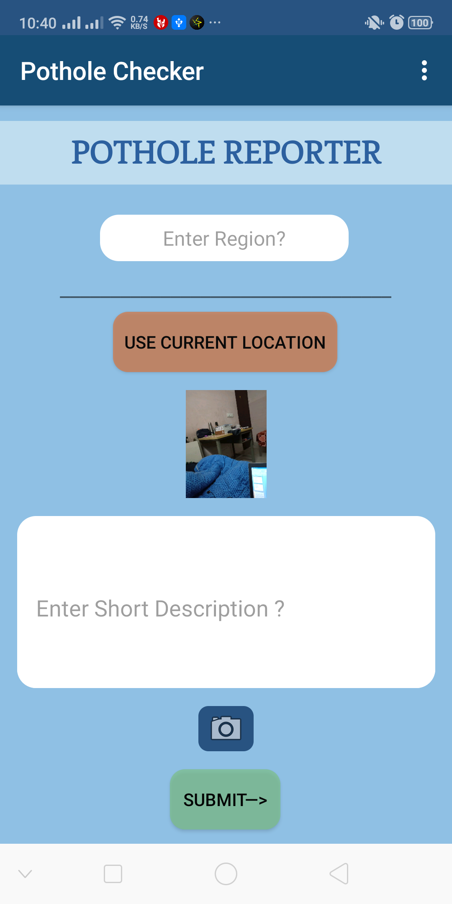
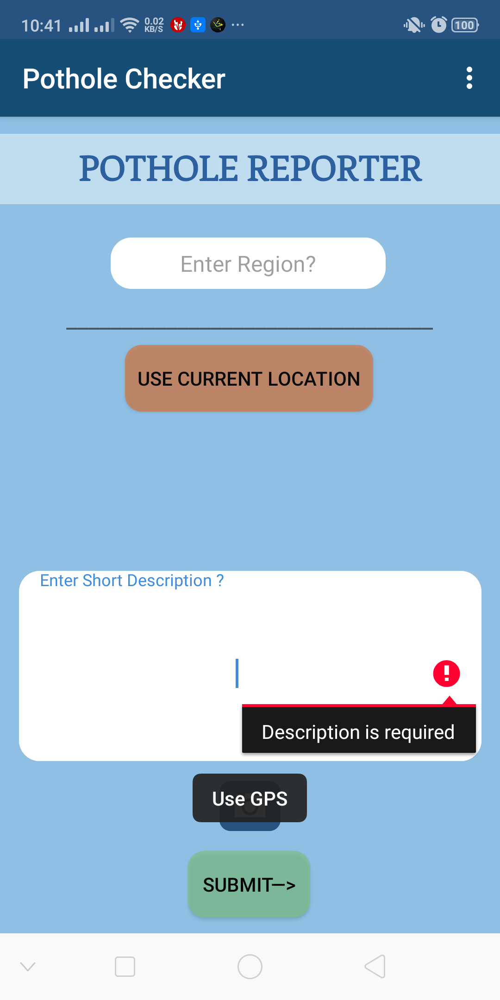
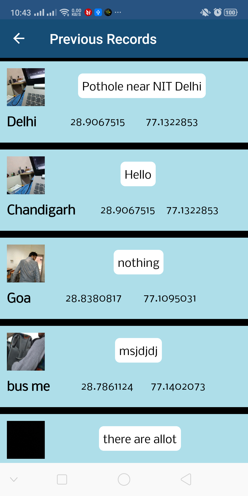

# Pothole Reporter
An App made for the Smart India Hackathon 2020. 
* An Android app that takes Current location (GPS), Image of Pothole and other details from the user and then stores that data on the Google Firebase so that it can be accessed by concerned department.
* The stored records are displayed on a Recycler view in another Fragment.
* Fused Location provider API is integrated in the app to get the accurate location of the user.

                                    
